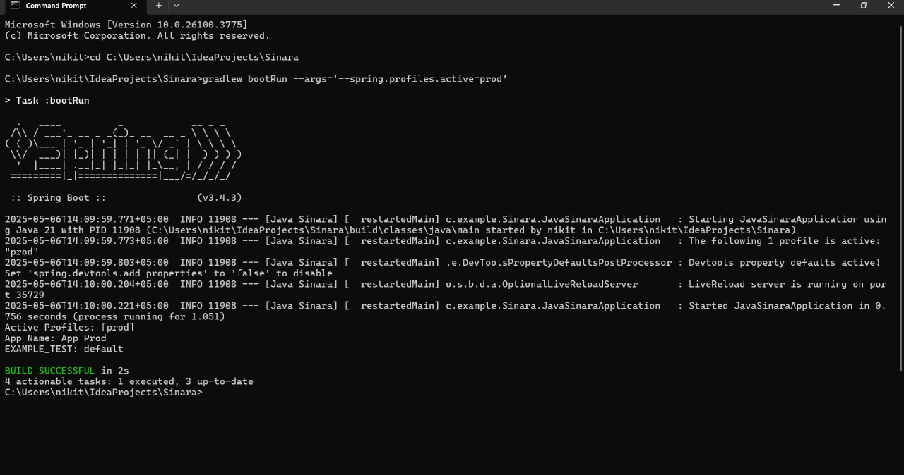
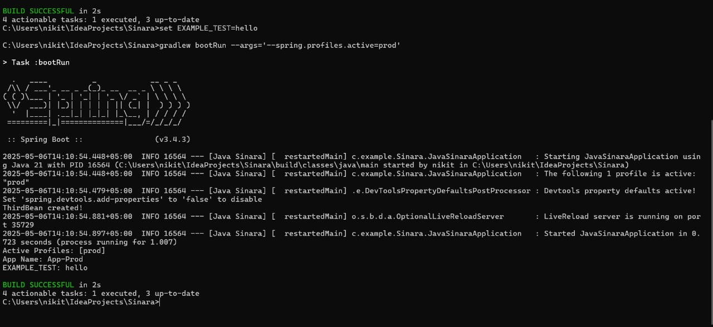

Дз конфиги (исправленное)
1) Создать 3 профиля - dev, test, prod, каждый из которых будет включать в себя:\
   a) конфиг с листом из нескольких значений\
   b) название приложения\
   c) конфиг с переменной окружения, по дефолту значение - default
2) 3 бина:
   a) один создается, только если профиль test,\
   b) другой, если существует первый бин,\
   c) третий, если в конфиге EXAMPLE_TEST (env var) не “default” (тут в идеале со скриншотом)

Скриншоты работы 3 бина
1) Когда переменная окружения не задана

2) Когда переменная окружения равна hello
